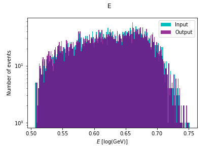
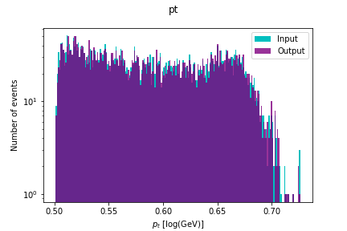
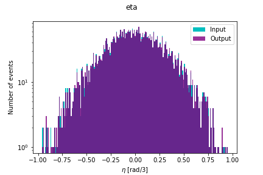
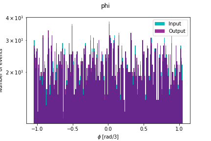

# ATLAS Evaluation

[**[Presentation]**](https://docs.google.com/presentation/d/1TEzEqilbNTESiVPPP8BjSedZ-YLAT2OCrAgii--jEik/edit?usp=sharing)

This repo contains the code for my submission of the task given by mentors for the GSoC 2021 Project: [Deep autoencoders for ATLAS data compression](https://hepsoftwarefoundation.org/gsoc/2021/proposal_ATLASCompressionAE.html) under [**CERN-HSF**](https://summerofcode.withgoogle.com/organizations/4526188451594240/) Organization.

**Problem Statement**: Prepare an autoencoder to compress the four-momentum of a sample of simulated ‘j’ particles from 4 to 3 variables for the dataset available on [drive](https://drive.google.com/file/d/1MJePFQT3OKdnmdlaJPNWwxqWrGEbj2F_/view).

## Contents
1. [Setup Instructions](#1-setup-instructions)
2. [Repository Overview](#2-repository-overview)
3. [Results](#3-results)

## 1. Setup Instructions

- Clone the repo:
```
git clone https://github.com/praeclarumjj3/ATLAS_Evaluation.git
```

- To run the AE Compression model and see the results, open [AE_Compression_3D.ipynb](https://github.com/praeclarumjj3/ATLAS_Evaluation/blob/master/AE_Compression_3D.ipynb) and run it cell by cell.


## 2. Repository Overview

The repository is structured as follows:

- `data` - Contains the datas files for training/testing the AE Compression model.
- `plotInput` - Contains images of the plots for `normalized` Input Data.
- `plotOutput` - Contains images of the plots for `normalized` Input Data.
- `prepare_datset.py` - Script for cleaning and preparing the `.pkl` file which contains the data used for training.
- `AE_Compression_3D.ipynb` - Contains code for running the model.


## 3. Results

- The compression model works well on the given dataset as can be seen from the overlapping output-input plots for the normalized data:








